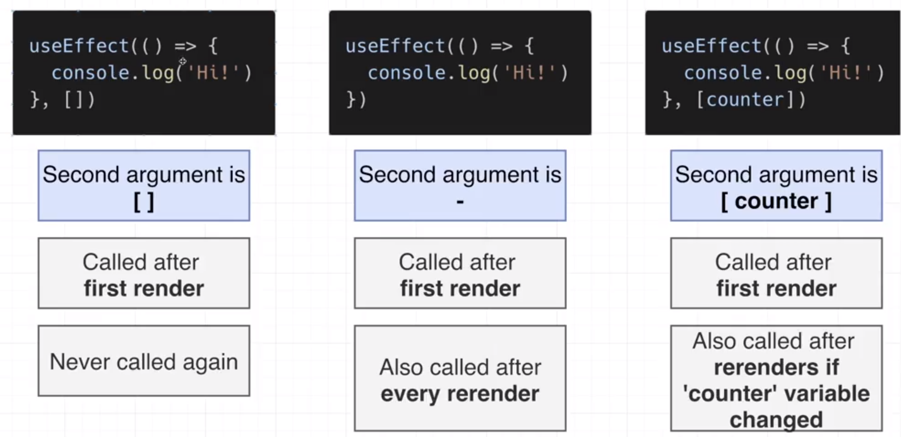

# Books Reading List

Try to replicate this:
- This app should let us create, edit and delete books from our reading list

## Run
For our app
`npm start`

For our simulated backend 
`npm run server`

## Topics to practice
- Form handling
 
- State updates (arrays and objects): See https://state-updates.vercel.app/

- Data persistance (using json-server)

- useEffect:

- Context OBjects

- Small intro to Hooks

- useCallback 

