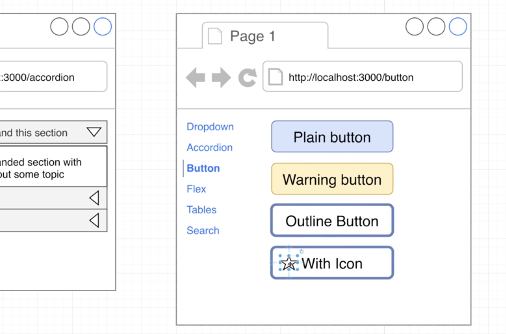
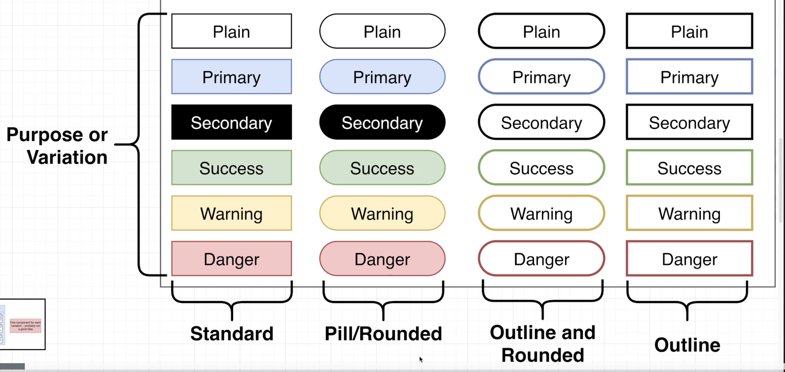

# Books Reading List

Try to replicate this:
- This will show us different components and styles

## Topics to practice
- Purpose or Variation

- prop-types to validate the props passed to a component (Typescript replaced i)
- classnames

- react.icons:  https://react-icons.github.io/react-icons/

- useRef

- navigation (user driven and programatic)

- Fragment

- customized hooks